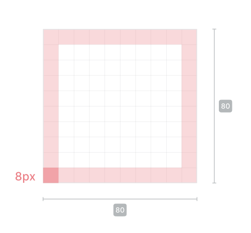
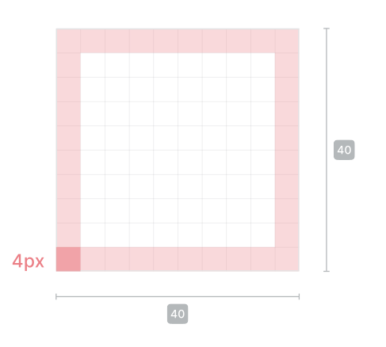

# Icons

This document contains detailed information and recommendation about the icons that can be used for an extensions and its components.

## Extension package icon

This icon is used in extension package list and extension package description. It is referenced in the extension metadata file.

### Construction

8px padding ensures icons will retain their
desired scale and surrounding white space.

### Size

80x80 px

### Safe area

8px

## Component icons

These icons are used in components panel and workflow nodes

### Construction

4px padding ensures icons will retain their
desired scale and surrounding white space.

### Size

40x40 px

### Safe area

4px

